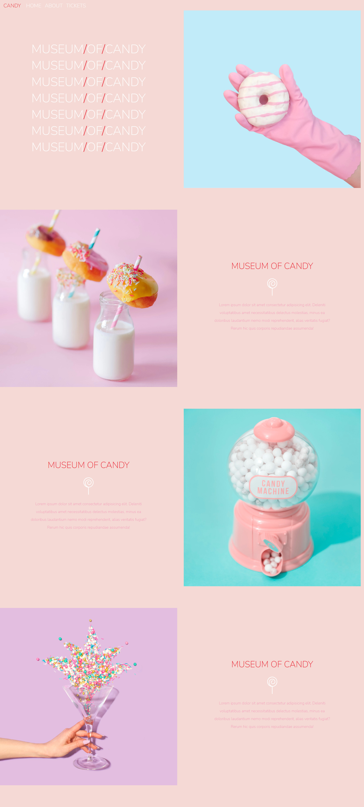

# Museum Of Candy [BootcampProject]

 A website project called "Museum of Candy" from Colt Steele's Bootcamp. 

## What do I have:
* Few photos in "img" folder
* index.html file with an attached link to the font and Bootstrap in the head tag
* Lots of "Lorem Ipsum" to fill the content

## What do I have to do:
* with a couple of nices photos I have to code a fully responsive landing page
* navbar should collapse and transform into hamburger menu if certain screen size will appear
* text and pictures should be shown in a particular order - if there's a small screen size then transform into a column. display text first and the photo below that

## What will I use:
**HTML, CSS, Bootrstrap, MediaQueries and tiny bit of JS**